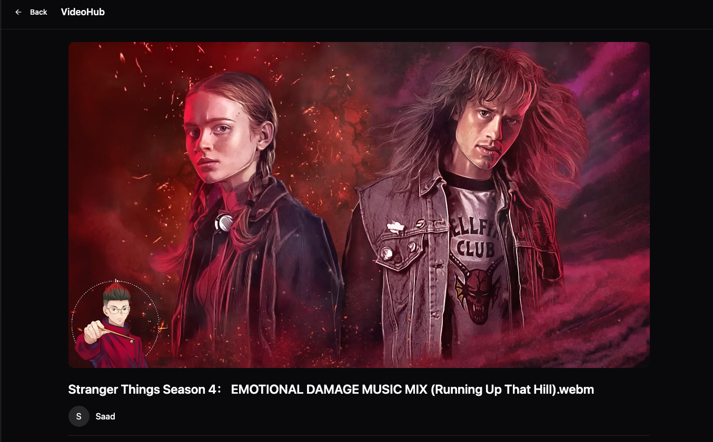
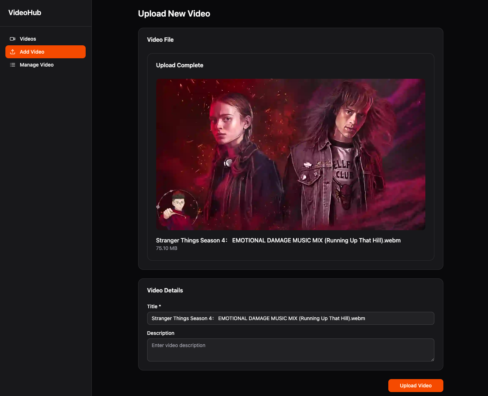

# Distributed Video Streaming Platform


> A multi-service, distributed system for uploading, transcoding, and streaming video content, built with a modern Node.js and React technology stack.

This project is a proof-of-concept video streaming platform designed to demonstrate a scalable, microservices-based architecture. It handles the entire lifecycle of a video, from initial upload to on-demand streaming, using a decoupled and containerized approach.

## Key Features

- **Video Upload:** Users can upload video files through the frontend.
- **Automated Transcoding:** Uploaded videos are automatically processed and converted into HLS (HTTP Live Streaming) format for adaptive bitrate streaming.
- **On-Demand Streaming:** Processed videos are available for streaming via an HLS-compatible video player.
- **User Management:** Basic user registration and login functionality (handled by the API Gateway).
- **Distributed Architecture:** Core functionalities are separated into independent, containerized services.

---

## Architecture

The platform is built using a microservices architecture. Each service is responsible for a specific business capability and communicates with others, typically through a combination of direct API calls and a message queue. This design allows for independent development, deployment, and scaling of each component.

**High-Level Flow:**

1.  **Upload:** A user uploads a video file via the **Frontend**. The file is sent to the **Upload Service**.
2.  **Queueing:** The **Upload Service** places the raw video file into a temporary storage location and pushes a message onto a queue (e.g., RabbitMQ).
3.  **Transcoding:** The **Transcode Service**, a dedicated worker, consumes the message from the queue. It downloads the raw video, transcodes it into multiple HLS renditions (.m3u8 playlists and .ts segments), and places the results in a permanent "processed" storage bucket.
4.  **Metadata Update:** Upon successful transcoding, the **Transcode Service** notifies the **API Gateway** to update the video's metadata in the database, marking it as "Ready".
5.  **Streaming:** When a user clicks "play" on the **Frontend**, the client requests the video manifest from the **Streaming Service**, which serves the HLS playlist and video segments.

```
+----------+      +---------------+      +------------------+
|          |----->| API Gateway   |<---->|   PostgreSQL DB  |
|          |      | (Users, Auth, |      +------------------+
| Frontend |      |  Metadata)    |
|  (React) |      +---------------+
|          |
|          |      +----------------+
|          |----->| Upload Service |----->[Message Queue]
|          |      +----------------+
|          |                                    |
|          |      +------------------+          |
|          |----->| Streaming Service|<---------+
+----------+      +------------------+      (processed files)
                                              |
                       +--------------------+   |
                       | Transcode Service  |---+
                       | (Worker)           |
                       +--------------------+
```

## Screenshots

<p align="center">
  
  
</p>

---

## Tech Stack

### Backend & DevOps

| Service               | Technology                          | Description                                                         |
| --------------------- | ----------------------------------- | ------------------------------------------------------------------- |
| **All Services**      | Node.js, TypeScript, Docker         | Core runtime, language, and containerization.                       |
| **API Gateway**       | Express.js, Drizzle ORM, PostgreSQL | Handles user auth, metadata, and routes requests to other services. |
| **Upload Service**    | Express.js, Multer                  | Manages ingestion of large video files.                             |
| **Transcode Service** | FFmpeg, BullMQ (or similar)         | A background worker for CPU-intensive video processing jobs.        |
| **Streaming Service** | Express.js                          | Serves HLS playlists and video segments securely.                   |
| **Orchestration**     | Docker Compose                      | Manages the multi-container local development environment.          |

### Frontend

| Component     | Technology     | Description                              |
| ------------- | -------------- | ---------------------------------------- |
| **Framework** | React, Vite    | Modern, fast UI development and tooling. |
| **Styling**   | CSS, Shadcn/ui | Global styles and component library.     |
| **Player**    | HLS.js         | Client-side HLS video playback.          |

---

## Getting Started

### Prerequisites

- [Docker](https://www.docker.com/get-started)
- [Docker Compose](https://docs.docker.com/compose/install/)
- Node.js (v18+)

### Installation & Running

1.  **Clone the repository:**

    ```bash
    git clone git@github.com:saadh393/video-streaming-platform.git
    cd video-streaming-platform
    ```

2.  **Set up environment variables:**

3.  **Build and run the containers:**
    From the root of the project, run:

    ```bash
    docker-compose up --build
    ```

    This command will build the Docker images for each service and start them.

4.  \*\*Access the application: `http://localhost:3000`

---

## Future Improvements & TODOs

This project provides a solid foundation, but a production-ready system requires further development. The following areas are key priorities for future work, demonstrating an understanding of what it takes to build robust, enterprise-grade software.

- Implement a Comprehensive Test Suite

- Establish a CI/CD Pipeline

- Structured Logging

- Implement a DLQ for the transcoding queue to handle and retry failed processing jobs gracefully.
